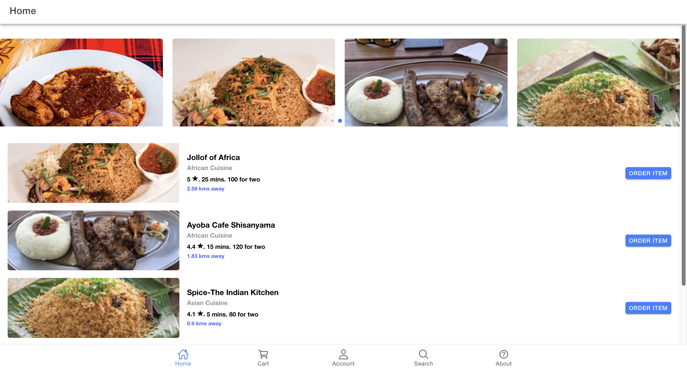
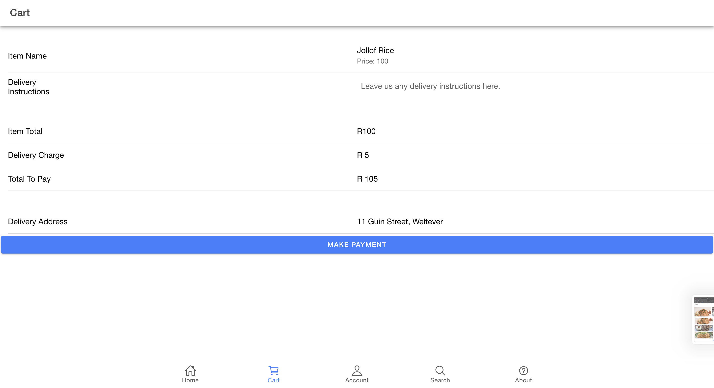
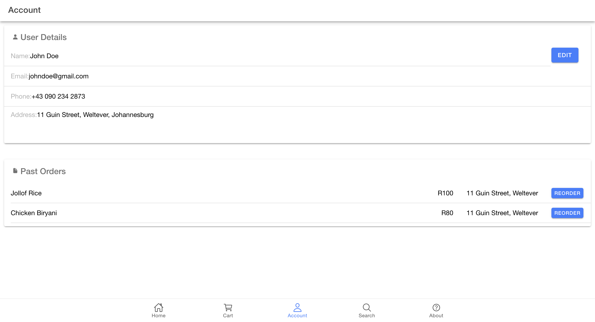

# 🍽️ Food Ordering App
Welcome to the Food Ordering App, a sleek and simple Ionic mobile app that makes ordering food from local restaurants effortless and user-friendly.

## 📱 Overview
This app simulates a food ordering experience, showcasing key mobile app development features using Ionic Framework and Angular.

### Screenshots

- Home Page

- Cart Page

- Account Page

## 🧩 Features
### 🏠 Home Page
- Slider & Listings: A visually appealing image slider followed by a list of restaurants.
- Restaurant Details: Tap on any restaurant to view its offerings.
- Quick Ordering: Clicking a restaurant auto-adds it to your cart.

### 🔍 Search Page
- Restaurant Search: Easily find restaurants using the search functionality.
- Instant Add-to-Cart: Tapping a result adds it to your cart immediately.

### 🛒 Cart
- Order Summary: View individual item prices and a total that includes VAT.
- Payment Modal: Click “Make Payment” to open a confirmation modal.

### 👤 Account Page
- Edit Profile: View and update your user details.
- Order History: Reorder previous meals with one click.

## ⚠️ Disclaimer
The images used in this app are for demonstration purposes and are not owned by the developer.

## 🚀 Technologies Used
- Ionic Framework
- Angular
- TypeScript
- SCSS / CSS

## 📦 How to Run
1. Clone the Repository
- git clone https://github.com/V-Jessie-Z/Food-Ordering-App.git
- cd Food-Ordering-App

2. Install Dependencies
- npm install

3. Serve the App
- ionic serve

## 🌐 Deployment
This app is deployed using GitHub Pages.

**Live Demo:** [Click here to try it!](https://v-jessie-z.github.io/Food-Ordering-App/tabs/home)

To deploy your own version:

- ionic build --prod
- npx angular-cli-ghpages --dir=docs

## 🧑‍💻 Author
Jessica Zimondi
